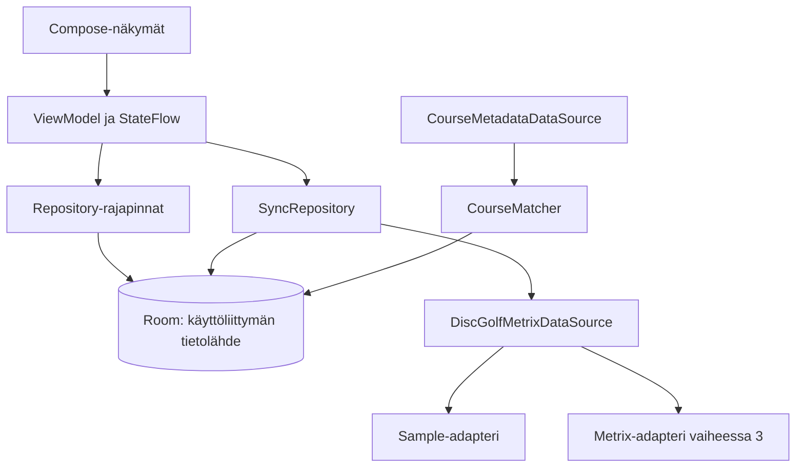

# Kiekkopolku — PHASE 1: tutkimus ja arkkitehtuuri

Päiväys: 5.10.2026. Tila: suunnitelma hyväksyttäväksi; Android-projektia ei ole toteutettu.

**Johtopäätös:** paikallinen MVP voidaan rakentaa esimerkkidatalla. Automaattinen koko perheen koko historian tuonti ei ole vielä varmistettu. Metrix dokumentoi integraatiokoodiin perustuvan historian haun, mutta pelkkä pelaaja-ID ei osoitetusti riitä. Suorat tuloshaut palauttivat vanhan datan saatavuusrajoituksen. Frisbeegolfradat.fi:n dokumentoitua julkista API:a tai datan uudelleenkäytön lupaa ei löytynyt tarkastetuista lähteistä.

Merkinnät:

- **VERIFIED / DOC:** palvelun omassa dokumentaatiossa todettu; ei välttämättä testattu toimivaksi.
- **VERIFIED / LIVE:** tämän tutkimuksen suoralla HTTP-kutsulla havaittu.
- **ASSUMPTION:** suunnitteluoletus tai oma ratkaisuehdotus, ei ulkoisen API:n lupaus.
- **TODO:** selvittämätön asia. Tiedon puuttuminen dokumentaatiosta ei todista ominaisuuden puuttumista.

## 1. DiscGolfMetrix-integraation faktat

**VERIFIED / DOC:** palvelulla on HTTP-API. Tähän projektiin liittyvät dokumentoidut kutsut ovat alla. Parametrien nimet ovat lähteistä, eivät ehdotuksia uusiksi rajapinnoiksi. [API-johdanto](https://discgolfmetrix.com/?ID=37&u=rule)

| Kutsu osoitteessa `https://discgolfmetrix.com/api.php` | Käyttö ja pääsyn ehdot | Lähde |
|---|---|---|
| `content=my_competitions&code=…` | Oman tilin kilpailu-ID:t. Asetuksista saatava integraatiokoodi. | [My competitions](https://discgolfmetrix.com/?ID=60&u=rule) |
| `content=result&id=…` | Tunnetun kilpailun/kierroksen tulokset. Ilman `code`-parametria vain julkiset kilpailut dokumentaation mukaan. | [Get Results](https://discgolfmetrix.com/?ID=38&u=rule) |
| `content=courses_list&country_code=FI` | Rataluettelo; valinnainen `name`-suodatin. | [List of courses](https://discgolfmetrix.com/?ID=49&u=rule) |
| `content=course&id=…&code=…` | Radan ja väylien tiedot; dokumentaatio listaa henkilökohtaisen koodin. | [Course](https://discgolfmetrix.com/?ID=50&u=rule) |
| `content=competitions&code=…&country_code=…&date1=…&date2=…` | Liitoille rajattu kilpailulista; ei yleiseksi pelaajahistorian hauksi. | [List of competitions](https://discgolfmetrix.com/?ID=65&u=rule) |

**VERIFIED / LIVE:** dokumentaation esimerkki `content=result&id=437198` palautti `Competition: null` ja virheen, joka ohjaa ottamaan yhteyttä `dev@discgolfmetrix.com` yli vuoden vanhan datan saamiseksi. Myös julkiselta tuloskorttisivulta löydetty ID `3434462` antoi saman vastauksen. Jälkimmäisen vastauksen rakenteen havainto on [tutkimusaineistossa](research/metrix-result-observation.json). Sen nollamäärät tarkoittavat puuttuvaa vastausdataa, eivät tapahtuman todellista osallistujamäärää. [Esimerkkikutsu](https://discgolfmetrix.com/api.php?content=result&id=437198), [toisen ID:n lähde](https://discgolfmetrix.com/?ID=3434462&u=scorecard_pdf)

**TODO:** rajoituksen tarkka soveltuminen koodilla tehtyihin hakuihin, tilausvaatimukset ja mahdollinen erillinen lupa. Kahdesta vastauksesta ei voi päätellä koko API:n kaikkia pääsyehtoja. Onnistunutta tulos-JSONia ei tässä tutkimuksessa saatu.

## 2. Mitä dataa voidaan saada

**VERIFIED / DOC:** tulosdokumentaatio näyttää tapahtuman tunnisteen, päivämäärän, ajan, radan nimen ja `CourseID`:n. Pelaajatasolla esitetään `UserID`, nimi, kokonaistulos, ero pariin ja keskeytysmerkintä. `PlayerResults` sisältää väylätuloksia; `Tracks` väylätunnuksia ja pareja. `SubCompetitions` mahdollistaa tapahtumahierarkian. Tämä osoittaa väyläkohtaisen datan tuen dokumentaatiossa, ei sen täydellisyyttä kaikille kierroksille. [Get Results](https://discgolfmetrix.com/?ID=38&u=rule)

**VERIFIED / DOC:** ratalista erottaa pääradan ja layoutin `Type`/`ParentID`-tiedoilla; mukana on nimi, paikkakunta, maa ja sijaintikenttiä. Listan koordinaatit on nimetty `X`/`Y`, radan yksityiskohtien `Lat`/`Lng`. Näille tarvitaan eri DTO:t. Yksityiskohtien esimerkissä on myös väylien par ja tiin/korin koordinaatteja. [Ratalista](https://discgolfmetrix.com/?ID=49&u=rule), [ratatiedot](https://discgolfmetrix.com/?ID=50&u=rule)

**ASSUMPTION:** näistä voidaan tuottaa kierroslistat, henkilökohtaiset ratakäynnit ja score == 1 -onnistumiset, kun todellisen vastauksen semantiikka on testattu. Historiallinen par ja väylän nimi tallennetaan kierroksen yhteyteen; niitä ei korvata radan nykyisellä layoutilla.

## 3. Epävarmuudet ja integraation hyväksymisportti

| TODO | Vaikutus ja tarvittava varmistus |
|---|---|
| Pelaaja-ID → koko historia ilman koodia | Ei löytynyt dokumentoitua reittiä. Ei luvata tätä käyttöliittymässä. |
| Perheprofiilien käyttöoikeudet | Oletus on oma koodi per tili; alaikäisten, jaettujen tilien ja koodin omistaja-ID:n varmennustapa selvitettävä. Yksi vanhemman koodi ei oletusarvoisesti kata kaikkia. |
| `my_competitions` kattavuus | Sisältyvätkö harjoitukset, yksityiset, vanhat, keskeytetyt ja monikierrostapahtumat? Onko aikarajaa, sivutusta tai järjestystakuuta? |
| Päivitykset | Ei varmistettua changed-since-parametria, cursoria, ETag-tukea tai poistotapahtumia. `lastSyncAt` on paikallinen tila, ei keksitty API-parametri. |
| Tulosten tulkinta | Väylätaulukkojen kohdistus, shotgun-järjestys, tyhjät/erikoisarvot, DNF/DNS, rangaistukset, tasoitukset ja pari-/joukkuepelit testattava. |
| Identiteetti | Yhteenvetotapahtuman ja varsinaisen kierroksen erottelu; layoutin ja fyysisen radan yhteys. |
| Muut kentät | Avatar, erillinen tee, aikavyöhyke ja muutosaika eivät ole varmistettuja. Null sallitaan. |
| Käyttörajoitukset | Dokumentoitu pyyntöbudjetti, lisenssi, paikallinen säilyttäminen ja pitkä historia varmistettava palvelulta. |

PHASE 3:n portti: luvallinen testitili, sen koodi turvallisesti paikallisesti syötettynä, onnistunut historian ja yhden kierroksen haku, väylätietojen kohdistus, vanhan datan saatavuus sekä palvelun käyttöehdot. Koodia ei pyydetä chattiin. Yhteydenottoja ei ole lähetetty.

## 4. Frisbeegolfradat.fi ja vaihtoehdot

**VERIFIED / DOC:** palvelu kerää ratojen sijainti-, layout- ja väylämäärätietoja sekä ratakarttoja. Tämä ei itsessään anna koneellista luku- tai uudelleenjulkaisuoikeutta. [Uuden radan ilmoittaminen](https://frisbeegolfradat.fi/ilmoita-uusi-rata/)

**TODO:** tarkastin etusivun linkit, tietosuojaselosteen, yhteystietosivun sekä rajattuja API- ja käyttöehtohakuja. Julkisen integraation dokumentaatiota tai sovellukseen kopioinnin lisenssiä ei löytynyt. Tämä ei osoita, ettei kumppanirajapintaa olisi. Tietosuojaseloste ei ole datalisenssi. [Palvelu](https://frisbeegolfradat.fi/), [tietosuojaseloste](https://frisbeegolfradat.fi/rekisteriseloste/), [yhteystiedot](https://frisbeegolfradat.fi/yhteystiedot/)

**ASSUMPTION / ehdotus:** ensin Metrixin ratatiedot ja käyttäjän paikallinen sijaintikorjaus. FGR-adapteri on pois käytöstä, kunnes ylläpidolta on saatu rajapinta, lupa, attribuutio- ja välimuistiehdot. Ratasivun käyttäjän lisäämä linkki voidaan avata selaimeen. Ei scraperia eikä oletettua WordPress-API:a.

Vaihtoehtoinen tutkimuskohde on DiscGolfAPI, jonka oma dokumentaatio kuvaa julkisen ratadatan API:n sekä attribuutioehdon. Suomen kattavuutta ja lisenssin sopivuutta tähän tuotteeseen ei ole varmistettu; sitä ei valita automaattisesti. [DiscGolfAPI-dokumentaatio](https://discgolfapi.com/docs/)

## 5. Ehdotettu Room-datamalli

**ASSUMPTION / suunnitteluehdotus:** seuraavat ovat Kiekkopolun omia kenttiä, eivät Metrix-DTO:n kenttiä. Paikalliset pääavaimet UUID-merkkijonoja; ulkoiset tunnisteet merkkijonoja. `?` tarkoittaa nullablea. Kaikki viiteavaimet indeksoidaan. Synkronointiajat UTC epoch-millis; pelipäivä ISO LocalDate, aika ja aikavyöhyke erillisinä nullable-kenttinä. Tuntematonta aikavyöhykettä ei oleteta Suomen ajaksi.

| Entity | Kentät ja avaimet |
|---|---|
| `PlayerEntity` | `id` PK, `metrixPlayerId` UNIQUE, `displayName`, `avatarUrl?`, `colorKey`, `iconKey`, `isActive`. `lastSyncAt` luetaan SyncStatesta domain-malliin, ei kahta totuutta. |
| `CourseEntity` | `id` PK, `name`, `normalizedName`, `city?`, `countryCode?`, `latitude?`, `longitude?`, `locationOrigin?`, `userEdited`. Fyysinen ratakohde, ei layout. |
| `CourseSourceRefEntity` | `(source, externalId)` PK, `courseId` FK, `parentExternalId?`, `sourceKind`, `layoutName?`, `matchMethod`, `confirmedAt?`. Saman lähteen usea layout-ID voi viitata samaan fyysiseen rataan. |
| `RoundEntity` | `id` PK, `(source, externalRoundId)` UNIQUE, `parentExternalEventId?`, `playedDate`, `localTime?`, `zoneId?`, `fetchedAt`. Vain pelattu kierros, ei sarjan yhteenvetoa. |
| `RoundPlayerEntity` | `(roundId, playerId)` PK/FK, `courseId?` FK, `sourceCourseId?`, `courseNameSnapshot?`, `layoutNameSnapshot?`, `teeSnapshot?`, `totalScore?`, `relativeToPar?`, `status`, `scoringMode`, `holeDataCompleteness`. Rata/layout on osallistujatasolla, jotta eri layoutit samassa tapahtumassa ovat mahdollisia. |
| `HoleScoreEntity` | `(roundId, playerId, holeOrdinal)` PK; yhdistelmä-FK RoundPlayeriin; `holeLabel`, `par?`, `score?`. Tallennettu järjestys ja näyttönimi erotetaan. |
| `CourseExternalMetadataEntity` | `(source, externalId)` PK, `courseId` FK, `address?`, `city?`, `countryCode?`, `latitude?`, `longitude?`, `courseType?`, `holeCount?`, `mapUrl?`, `pageUrl?`, `fetchedAt`, `attribution?`, `licenseUrl?`. Lähteen tieto ei ylikirjoita käyttäjän korjausta. |
| `SyncStateEntity` | `(playerId, source)` PK/FK, `lastAttemptAt?`, `lastSyncAt?`, `lastFullSyncAt?`, `status`, `errorCode?`, `historyCoverage`, `pendingRoundIdsJson?`. Ei integraatiokoodia. |

RoundPlayer ratkaisee yhteisen tapahtuman: kahden perheenjäsenen sama kierros tuottaa yhden Roundin ja kaksi osallistumista. Väylätulokset kuuluvat osallistumiseen. Pelaajan poisto poistaa tämän osallistumiset, väylät, sync-tilan ja salaisuuden; muiden pelaajien yhteinen Round säilyy. Orvot Roundit poistetaan transaktiossa. Radan poistamista viitattuna estetään; yhdistäminen tehdään hallittuna viitteiden siirtona.

Kierros–rata-relaatio kulkee osallistumisen kautta. Tuntematon rata ei estä tulosten tallentamista, mutta sitä ei lasketa tunnistetuksi uniikiksi radaksi eikä karttamerkiksi. Puuttuvien ratatietojen määrä näytetään.

Tilastojen laskentasopimus:

- Aktiivinen tyhjä valinta tarkoittaa tyhjää tulosta, ei kaikkia pelaajia.
- Yhteinen ratamäärä: distinct `courseId` valituista pelatuista osallistumisista.
- Kierroksia yhteensä: valittujen pelaajien pelatut osallistumiset; lisäksi voidaan näyttää erillinen yhteisten kierrostapahtumien distinct Round -määrä. Nämä nimetään käyttöliittymässä yksiselitteisesti.
- Pelattu osallistuminen: valmis kierros tai keskeytetty kierros, jolla on pelattuja väyliä. Pelkkä ilmoittautuminen/DNS ei kasvata historiaa. Keskeytys näkyy erikseen.
- Acet: yksilöpelin tunnetut väylätulokset `score == 1`, myös osittaisen kierroksen tunnetuilta väyliltä. Joukkueen tulosta ei kirjata henkilön aceksi. Puuttuva väylädata tekee määrästä tunnettujen acejen määrän, ei todistettua koko uran määrää.
- Ensimmäinen/viimeinen päivämäärä lasketaan samasta suodatetusta pelattujen osallistumisten joukosta. Tasatilanteet järjestetään pysyvällä tunnisteella.

CourseMatcher palauttaa `Exact`, `Suggested`, `Ambiguous` tai `Unmatched`. Tallennettu lähdetunniste tai varmistettu Metrix-parent-suhde voi yhdistää automaattisesti. Pelkkä läheisyys ei riitä: samassa puistossa voi olla useita ratoja. Normalisoitu nimi + maa/kaupunki ja koordinaatit tuottavat ehdotuksen; ristiriita tai usea ehdokas vaatii käsittelyn. Nimestä ei poisteta layout-eroja summittaisesti. Ehdotetut etäisyysrajat määritetään testidatalla, eivät ole vielä tuotantosääntö.

## 6. Ehdotettu arkkitehtuuri

**ASSUMPTION / päätösehdotus:** yksi `:app`-moduuli ja ominaisuuksittain jaetut UI-paketit. Kotlin, Compose, Material 3, Hilt, Room, Coroutines/Flow, Kotlin Serialization; Retrofit/OkHttp vasta oikeaan verkkoadapteriin. Gradle Kotlin DSL ja version catalog. Tarkat yhteensopivat versiot valitaan PHASE 2:n alussa. Ei backendia MVP:hen.



PlayerRepository hallitsee profiileja ja aktiivivalintaa. CourseRepository ja RoundRepository tarjoavat suodatetut Flow-kyselyt ja yksityiskohdat. StatsRepository tekee Room-aggregaatit ilman omaa tilastovälimuistia. SyncRepository vastaa verkkotyön koordinoinnista. Domain-mallit ja repository-rajapinnat eivät tunne Retrofit-DTO:ita. Erillisiä use case -luokkia lisätään vain jaetulle logiikalle kuten matching ja ace-laskenta.

Room on lukemisen totuuslähde. Näyttö näyttää vanhat tiedot myös synkronoinnin aikana. Tämä vastaa Androidin offline-first-ohjetta. [Android Developers](https://developer.android.com/topic/architecture/data-layer/offline-first)

Synkronointiehdotus:

1. Näytä Room heti. Käynnistyksen jälkeen päivitä valitut, vanhentuneet profiilit; pull-to-refresh käyttää samaa koordinaattoria. Vanhentumisraja on konfiguroitava paikallinen päätös.
2. Estä päällekkäinen työ pelaaja-/lähdekohtaisesti; yhteiset tapahtuma-ID:t yhdistetään hakujonossa. Jos tarvitaan taustalla jatkuvaa työtä, käytetään WorkManagerin yksilöityä työtä ja verkkorajoitetta.
3. Hae historian ID:t dokumentoidulla koodipolulla. Erottele uudet paikallisista. Hae uudet, keskeneräiset ja rajattu määrä viimeaikaisia tunnettuja kierroksia. Vanhojen korjausten löytämiseen tarvitaan erillinen täyden tarkistuksen toiminto; ilman muutosrajapintaa niitä ei voi taata muuten.
4. Validoi vastaus ja API:n `Errors` myös HTTP 200:ssa. Muunna vain varsinaiset kierrokset; älä laske sarjan yhteenvetoa toiseen kertaan. Tallenna vain lisättyjen pelaajien tulokset.
5. Tee yhden kierroksen hyväksytty kirjoitus transaktiossa. Käytä upsertia pysyvillä avaimilla. Täydellinen uusi tuloskorvaus voi poistaa poistuneet väylät; osittainen vastaus ei tyhjennä aiempaa täydellistä tulosta. Muiden pelaajien tietoja ei poisteta kapean vastauksen vuoksi.
6. Tallenna onnistuneet erät myös osittaisessa epäonnistumisessa. `lastSyncAt` päivittyy vasta pelaajan koko suunnitellun työn onnistuttua; keskeneräisen jonon voi jatkaa. Tallenna kattavuus erikseen: onnistuminen ei tarkoita koko uran saatavuutta.
7. Verkko- ja palveluvirheet saavat rajatun backoff-uusinnan; 429:ssa huomioi Retry-After. Väärä koodi/puuttuva lupa ei saa loputonta retrytä. Peruutus välitetään. Verkkokutsu ei pidä DB-transaktiota auki.
8. Puuttuminen yhdestä listavastauksesta ei poista historiaa. Varmistettu poistuminen tai käyttöoikeuden peruuntuminen tarvitsee erillisen politiikan ennen verkkoversion julkaisua.

Tietoturva: integraatiokoodit salataan Android Keystoren suojaamalla avaimella sovelluksen yksityiseen tallennukseen; Roomissa on vain viite tarvittaessa. Ei salasanojen keräämistä. Koodillisten URL:ien queryt, HTTP-lokit ja crash-raportit suodatetaan. Salaisuudet ja yksityinen historia rajataan automaattivarmuuskopioinnin ulkopuolelle MVP:ssä. Avaimen menetys edellyttää uudelleenliittämistä. [Android Keystore](https://developer.android.com/privacy-and-security/keystore)

Karttaehdotus vaiheeseen 4: Google Maps Compose ja clustering. Google-projektin määritys, avainrajoitukset ja laskutusedellytykset tarkistetaan ennen käyttöönottoa. Offline-lupaus koskee Room-historiaa, ei taustakarttojen täydellistä saatavuutta. Puuttuvat koordinaatit näkyvät listassa. Käyttäjän GPS-lupaa ei tarvita pelattujen ratojen näyttämiseen. [Maps Compose](https://developers.google.com/maps/documentation/android-sdk/maps-compose)

UI: yhteinen pelaajavalitsin; valinta säilyy Roomissa. Näkymäkohtaiset loading/empty/error-tilat, viimeisin onnistunut päivitys ja tiedon kattavuus. Suomenkieliset tekstit `strings.xml`:ssä, määrät `plurals`-resursseissa; päivät lokalisoidaan. Vaalea ja tumma vihreä Material 3 -teema, nimet värien rinnalla. Nykyiset logot ovat edelleen hyväksymättömiä luonnoksia.

## 7. Ehdotettu package/file tree

Tämä on suunnitelma, ei luotu Android-projekti. `fi.kiekkopolku.app` on alustava applicationId/package; omistajuus ja lopullinen tunniste päätetään ennen jakelua.

```text
kiekkopolku/
├── README.md
├── docs/PHASE-1.md
├── docs/research/
├── assets/brand/
├── settings.gradle.kts
├── build.gradle.kts
├── gradle/libs.versions.toml
├── gradle/wrapper/
└── app/
    ├── build.gradle.kts
    ├── schemas/                         # Room-skeemahistoria
    └── src/
        ├── main/
        │   ├── AndroidManifest.xml
        │   ├── java/fi/kiekkopolku/app/
        │   │   ├── KiekkopolkuApplication.kt
        │   │   ├── MainActivity.kt
        │   │   ├── di/{DatabaseModule,RepositoryModule,NetworkModule}.kt
        │   │   ├── domain/
        │   │   │   ├── model/{Player,Course,Round,HoleScore,Ace,Stats}.kt
        │   │   │   ├── repository/{Player,Round,Course,Stats,Sync}Repository.kt
        │   │   │   └── logic/{CourseMatcher,AceCalculator}.kt
        │   │   ├── data/
        │   │   │   ├── local/KiekkopolkuDatabase.kt
        │   │   │   ├── local/entity/    # Taulukon yhdeksän entityä
        │   │   │   ├── local/dao/{Player,Course,Round,Stats,Sync}Dao.kt
        │   │   │   ├── source/{DiscGolfMetrixDataSource,CourseMetadataDataSource}.kt
        │   │   │   ├── sample/SampleDiscGolfMetrixDataSource.kt
        │   │   │   ├── remote/metrix/{MetrixApi,MetrixDtos,MetrixMapper}.kt
        │   │   │   ├── repository/     # Konkreettiset toteutukset
        │   │   │   ├── security/CredentialStore.kt
        │   │   │   └── sync/{SyncCoordinator,SyncWorker}.kt
        │   │   └── ui/
        │   │       ├── navigation/KiekkopolkuNavHost.kt
        │   │       ├── components/PlayerSelector.kt
        │   │       ├── theme/
        │   │       └── feature/
        │   │           ├── profiles/
        │   │           ├── courses/
        │   │           ├── coursedetail/
        │   │           ├── rounds/
        │   │           ├── rounddetail/
        │   │           ├── aces/
        │   │           ├── stats/
        │   │           └── map/        # Vaihe 4
        │   └── res/{values,values-night,drawable,mipmap-*}/
        ├── test/                      # Domain, mapping, sync
        └── androidTest/               # Room, migraatiot, Compose-polut
```

## 8. Merkittävimmät tekniset riskit

| Riski | Hallinta |
|---|---|
| Koko historia ei ole saatavilla | Kriittinen PHASE 3 -portti. Näytä saatavuus, älä väitä osittaista historiaa täydelliseksi. |
| ID-pohjainen lisääminen ei riitä | Profiilin voi lisätä paikallisesti; verkkosynkronointi tarvitsee erillisen liittämisen, jos koodipolku vahvistuu. |
| Tapahtuma/layout/rata sekoittuvat | Erilliset identiteetit, yhteinen Round ja osallistujakohtaiset tulokset; parent-suhteen validointi. |
| Virheelliset acet | Puuttuvaa tulosta ei muuteta nollaksi/ykköseksi; joukkuepelit ja erikoismerkit erikseen. |
| Vanha tulos muuttuu jälkikäteen | Rajattu uudelleenhaku + käyttäjän täysi tarkistus; ei valheellista inkrementaalisuustakuuta. |
| Epävarma ratayhdistely | Epäselvät osumat ehdotuksiksi. Väärä yhdistely vääristäisi kaikki tilastot. |
| Salaisuuksien vuoto query-parametreista | Ei täydellisten URL:ien lokitusta, salattu tallennus ja varmuuskopioiden rajaus. |
| Puutteelliset koordinaatit / karttapalvelun riippuvuus | Historia ja listat toimivat ilman karttaa; karttatiedon kattavuus näkyy. |
| FGR:n datalupa avoin | Integraatio pois käytöstä; ydintoiminnot eivät riipu siitä. |

## 9. Local MVP:n rajaus

**ASSUMPTION / ehdotus hyväksyttäväksi:** vaiheessa 2 toteutetaan profiilien lisäys/poisto, monivalinta, Room, ratalistan haku ja neljä järjestystä, radan pelaajittaiset kierrokset, kierroksen väylät, Acet ja Tilastot. Kierroslista sisältyy navigaation toimivaan peruspolkuun. Sample-datan saa ottaa erikseen käyttöön ja se merkitään esimerkkidataksi; sitä ei esitetä oikeana perhehistoriana.

Mukana heti: suomenkieliset resurssit, dark mode, tyhjät/virhetilat, offline-luku, tietokannan säilyminen uudelleenkäynnistyksessä ja laskennan perustestit. Kartta tulee vaiheessa 4, joten vaiheessa 2 ei näytetä toimimattomaksi jätettyä karttanappia. Ei oikeaa Metrix-synkronointia, FGR-dataa, pilvitiliä tai laitteiden välistä perhejakamista.

## 10. Konkreettinen toteutus- ja testisuunnitelma

1. **Hyväksyntä tämän raportin jälkeen.** Vahvistetaan local MVP -rajaus. PHASE 3:n avoimet kohdat eivät estä sample-MVP:tä, mutta estävät lupaamasta tuotantointegraatiota.
2. **PHASE 2a:** Gradle-projekti, Compose/M3/Hilt/Room, entityt, indeksit, DAO:t ja skeemavienti. Hyväksymistesti: sama esimerkkikierros kahdesti ei tuota duplikaatteja; kaksi pelaajaa jakaa yhden tapahtuman.
3. **PHASE 2b:** sample-adapteri ja repositoryt, profiilit ja suodatus. Testit: tyhjä/yksi/usea pelaaja, profiilin poiston vaikutus yhteiseen kierrokseen, tiedon säilyminen prosessin uudelleenkäynnistyksessä.
4. **PHASE 2c:** Radat → radan kierrokset → kierros, Acet, Tilastot. Testit: uniikit fyysiset radat useasta layoutista, kaksi acea samalla kierroksella, null/erikoistulos, keskeytys ja joukkuepeli; haku ja järjestysten determinismi. Sample-aineistoon myös puuttuva sijainti, sama nimi eri kaupungissa ja muuttunut layout.
5. **PHASE 3a:** sulje integraatioportti luvallisella tilillä ja palvelun vastauksilla. Tallenna anonymisoidut todelliset fixturet, päivitä DTO-sopimus. `DTO → domain` -testit vasta todelliselle sopimukselle; sample-mallia ei kutsuta vahvistetuksi Metrix-DTO:ksi.
6. **PHASE 3b:** Retrofit-adapteri, turvallinen koodin liittäminen, synkronointi. Testit: API-virhe HTTP 200:ssa, timeout, 429, väärä koodi, osittainen erä, retry, peruutus, rinnakkainen refresh, päivittynyt vanha tulos, puuttunut väylä, lastSyncAt ja transaktion rollback. MockWebServeriin fixturet; Room-instrumentaatiotesti oikeille unique/FK-säännöille.
7. **PHASE 4:** kartta, aktiivivalinta, markerin tietokortti ja clustering. Testit puuttuville koordinaateille, lähekkäisille eri radoille ja offline-listalle. Avaimet paikallisesta asetuksesta, ei repositoryyn.
8. **PHASE 5:** metadatalähde vasta luvan ja sopimuksen jälkeen. CourseMatcher-testit: tarkka lähde-ID, varmistettu parent, ristiriitainen maa, sama nimi, läheiset erilliset radat, usea ehdokas ja käyttäjän vahvistus.
9. **PHASE 6:** saavutettavuus, suuret fontit, ruudunluku, dark mode, Room-migraatiot, virhepolut, suorituskyky isolla synteettisellä historialla, dokumentaatio ja hyväksytyn logon Android-resurssit. Testejä tehdään jo aiemmissa vaiheissa, ei vasta lopuksi.

**Tämän vaiheen lopputila:** tutkimus ja arkkitehtuuriehdotus ovat valmiit tarkastettavaksi. Ulkoisten palveluiden avoimet asiat on dokumentoitu TODO:iksi, niitä ei ole ratkaistu oletetuilla endpointeilla. Android-projektin toteutus odottaa käyttäjän hyväksyntää.
