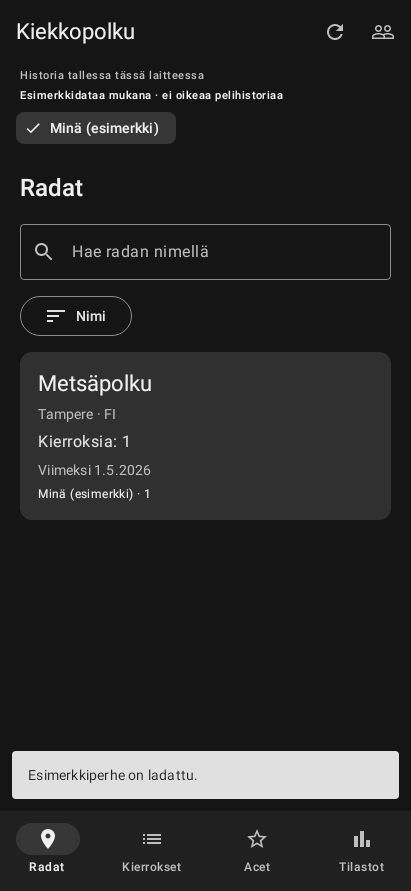

# Kiekkopolku 0.2.0 — tumma harmaa ja Metrix-profiilien liittäminen

## Käyttöliittymä

Sovellus käyttää aina tummaa hiilenharmaata teemaa puhelimen teema-asetuksesta riippumatta. Myös painikkeet, valinnat, kortit, pelaajatunnisteet ja käynnistyksen tausta ovat harmaasävyisiä. Vihreät logoluonnokset säilyvät historiallisina ehdotuksina; niitä ei käytetä sovelluksessa.

Pelaajan voi lisätä ID:llä, integraatiokoodilla tai molemmilla. Näyttönimi on vapaaehtoinen. Koodin tarkistuksen aikana lomake lukitaan; virheessä syötteet säilyvät, eikä profiilia tallenneta. Olemassa olevaan ID-profiiliin voi liittää tai vaihtaa koodin profiilikortin painikkeella. ID-profiilin voi avata Metrixin sivulle selaimeen.

## Varmistetut integraatiorajat

- **VERIFIED / DOC:** `GET https://discgolfmetrix.com/api.php?content=my_competitions&code=…` on dokumentoitu oman tilin kilpailulistan haku. Sen tuloskenttä on `my_competitions`, kilpailu-ID:iden taulukko. Dokumentaatio ei kuvaa omistajan pelaaja-ID:n palauttamista. [Metrixin dokumentaatio](https://discgolfmetrix.com/?ID=60&u=rule)
- **VERIFIED / LIVE:** ilman koodia API palauttaa puuttuvan parametrin virheen. Tarkoituksella virheellisellä testikoodilla se palautti `{"Errors":[]}`. Tyhjä virhetaulukko yksin ei siis todista koodia toimivaksi: adapteri vaatii lisäksi dokumentoidun kilpailu-ID-taulukon.
- **VERIFIED / LIVE:** pelaajaprofiilin URL-muoto `/player/{id}` löydettiin Metrixin julkisesta tapahtumasivusta. Käyttäjän toimittaman tilapäisen testiprofiilin haku ohjautui kirjautumissivulle. Profiilin julkista nimeä tai ID:n omistajuutta ei siten vahvistettu. [Julkinen tapahtumasivu](https://discgolfmetrix.com/3434462)
- **TODO:** oikean integraatiokoodin onnistunutta verkkovastausta ei ole testattu, sillä käyttäjä ei toimittanut koodia. Dokumentoidut onnistumisvastaukset testataan synteettisesti. Historiatuonti, vanhan datan lupa ja koodin omistajan tunnistaminen ovat edelleen erillisiä vaiheita.

ID-lisäys tallentaa käyttäjän antaman ID:n, ei varmista tiliä eikä hae sen kierroksia. Koodilisäys tarkistaa kilpailulistan saatavuuden, mutta ei vielä tuo kierroksia. Koodista ei arvata pelaaja-ID:tä muiden kilpailijoiden nimien perusteella. Pelkällä koodilla lisätyn profiilin pelaaja-ID pysyy tuntemattomana; käyttäjä voi liittää ID:n myöhemmin samalla koodilla. ID:n ja koodin kuulumista samalle Metrix-tilille ei väitetä varmennetuksi.

## Tallennus ja päivitys

Integraatiokoodi salataan AES-GCM:llä Android Keystoren suojaamalla avaimella yksityiseen SharedPreferences-tallennukseen. Jokainen kirjoitus käyttää uutta IV:tä, ja salaus on sidottu paikalliseen profiilitunnisteeseen. Koodia ei tallenneta Roomiin, Bundleen, lokeihin tai Gitiin. HTTP-asiakkaalla ei ole loki-interceptoria tai levyvälimuistia, eikä se seuraa koodillisen pyynnön uudelleenohjauksia. HTTPS on pakollinen. Automaattinen varmuuskopiointi ja laitesiirto on rajattu pois.

Room 1 → 2 lisää nullable `externalPlayerId`-kentän sekä koodin olemassaololipun. Vanha `metrixPlayerId`-sarake säilyy sisäisenä identityKey-avaimena, jotta vanhaa pelaajataulua ei tarvitse purkaa suhteineen. Koodiprofiilin sisäistä avainta ei esitetä pelaaja-ID:nä eikä lähetetä Metrixiin. Päivitys säilyttää vanhat profiilit, kierrokset ja väylätulokset; tuhoavaa migraatiota ei käytetä.

Sovellus on edelleen paikallisen historian MVP. Päivitä tiedot -painike ei väitä hakeneensa oikeaa historiaa. Koodin onnistunut liittäminen ei päivitä kierrosten `lastSyncAt`-aikaa.

## Testit ja tietosuoja

Testit kattavat ID-lisäyksen, koodilisäyksen ilman nimeä/ID:tä, koodin liittämisen olemassa olevaan profiiliin, ristiriitaiset tunnisteet, virheellisen koodin, salauksen satunnaisuuden ja profiilisidonnan sekä Room 1 → 2 -migraation historiatietoineen. Aiemmat historia-, ace- ja UI-testit säilyvät.

Käyttäjän antamaa testipelaaja-ID:tä ei sisällytetä lähdekoodiin, testifixtureihin, dokumentaatioon, esimerkkidataan tai APK:n oletusarvoihin. Testit käyttävät kuvitteellisia tunnisteita. Oikean laitteen Keystore- ja verkkotestaus tehdään sovellukseen itse syötetyllä koodilla.

Lopullinen varmennus 5.10.2026: APK-käännös onnistui, **26/26 testiä läpäisi** ja lintissä oli **0 virhettä**. Varoitukset koskevat lukittujen riippuvuuksien päivityksiä (27) ja KTX-apufunktioiden käyttösuosituksia (3). APK on allekirjoitettu samalla debug-avaimella kuin 0.1.0. Testipelaajan tunnisteen puuttuminen lähdekoodista ja APK:n DEX-merkkijonoista tarkistettiin erikseen; tilapäinen profiilivastaus poistettiin.

Käyttöliittymätestin renderöity ratanäkymä:

